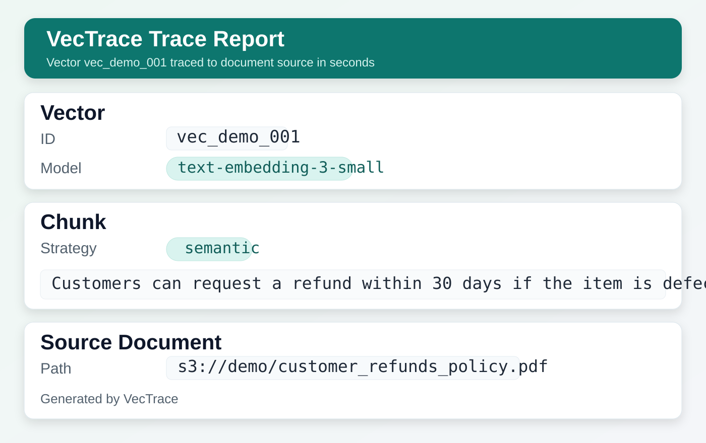
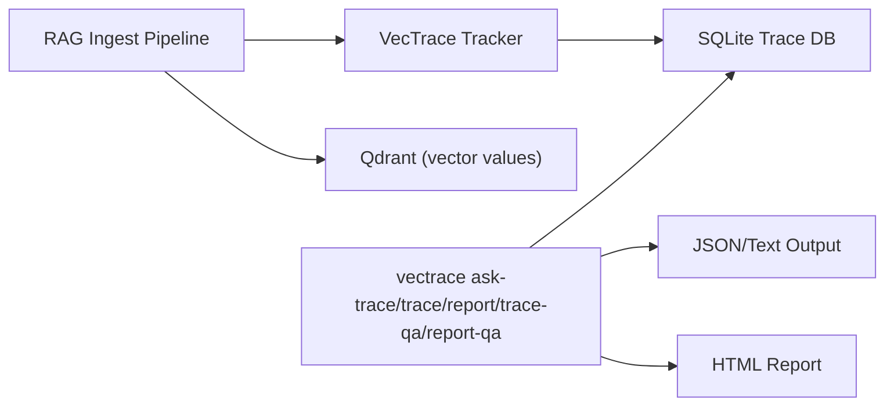

# VecTrace

**Wrong RAG answer? Trace it to the exact vector, chunk, and source document.**

`vectrace` is a CLI to debug a single wrong RAG answer by tracing it back to its exact source.
Use it when one answer is wrong and you need to find the exact document and chunk that caused it.

Tagline:
- `vectrace — trace where your RAG answers come from`

## Start Here

If you only try one thing, run this:

```bash
vectrace ask-trace \
  --db ./vectrace.db \
  --collection support_kb \
  --question "Can I get a refund after 90 days?" \
  --final-answer "Yes, refunds are allowed." \
  --top-k 3 \
  --output ./ask-trace.html \
  --json-output ./ask-trace.json
```

This runs retrieval, links results to source data, and generates a trace report.

This gives you:
- `ask-trace.html` (shareable report)
- `ask-trace.json` (machine-readable payload)

## Output Preview



## What You Get

VecTrace links these layers in one place:
- Retrieval context: question, answer, rank, score, metadata
- Retrieval mode: `exact` (from your retriever telemetry) or `bootstrap` (best-effort lexical fallback)
- Vector provenance: vector ID, embedding model, run info
- Source evidence: chunk ID/index/snippet and source document path/version

## Incident Example

Scenario:
- Question: `Can I get a refund after 90 days?`
- Answer: `Yes, refunds are allowed.`
- Policy evidence: `Refunds are only allowed within 30 days for eligible defects.`

Run:

```bash
vectrace ask-trace \
  --db ./vectrace.db \
  --collection support_kb \
  --question "Can I get a refund after 90 days?" \
  --final-answer "Yes, refunds are allowed." \
  --top-k 3 \
  --output ./incident-refund.html \
  --json-output ./incident-refund.json
```

Check in output:
- `evidence.support_status` (expected: `unsupported`)
- `evidence.support_reason` (shows why)
- `evidence.chunk_text` + `source_path` for exact source proof

## Core Commands

- `vectrace ask-trace ...` for first-time debugging with no manual vector IDs.
- `vectrace trace ...` when you already have a vector ID.
- `vectrace report ...` when you want HTML from a known vector ID.

## Quickstart

```bash
python3 -m venv .venv
source .venv/bin/activate
python3 -m pip install setuptools wheel
python3 -m pip install -e . --no-build-isolation

vectrace init --db ./vectrace.db
vectrace onboard --db ./vectrace.db --output ./trace-demo.html
vectrace ask-trace \
  --db ./vectrace.db \
  --collection support_kb \
  --question "Can I get a refund after 90 days?" \
  --top-k 3 \
  --output ./ask-trace.html \
  --json-output ./ask-trace.json
```

## Advanced / Integration

Use these when integrating with your existing retriever/serving pipeline.

### Auto-record from a Qdrant search (`TrackedQdrant.search_with_tracking`)

Skip the CLI for real RAG requests — wrap your Qdrant client and each search
call records its own retrieval events:

```python
from connectors.qdrant import TrackedQdrant

with TrackedQdrant(qdrant_url="http://localhost:6333", db_path="./vectrace.db") as rag:
    hits, query_id = rag.search_with_tracking(
        collection_name="support_kb",
        query_text="Can I get a refund after 90 days?",
        query_vector=embed("Can I get a refund after 90 days?"),
        limit=3,
        final_answer="Yes, refunds are allowed.",  # optional; can attach later
    )
    # ... pass `hits` to your LLM as usual

# Then debug the answer the same way you would with the CLI:
#   vectrace report-qa --db ./vectrace.db --collection support_kb \
#     --question "Can I get a refund after 90 days?" --output ./trace.html
```

Lineage writes are best-effort: if SQLite fails, the search still returns and
the failure is logged to stderr. The returned `query_id` lets you correlate
later commands or attach a final answer to the same retrieval event group.

### Record real retrieval telemetry (`record-retrieval`)

To attach exact retriever rank/score/vector IDs from your app:

```bash
vectrace record-retrieval \
  --db ./vectrace.db \
  --collection support_kb \
  --vector-id vec_101 \
  --query-text "Can I get a refund after 90 days?" \
  --final-answer "Yes, refunds are allowed." \
  --rank 1 \
  --score 0.87 \
  --evidence-text "Refunds are only allowed within 30 days for eligible defects." \
  --metadata-json '{"request_id":"req-123","session_id":"s-1"}'
```

### Bootstrap from question+answer (`record-qa`)

If retriever telemetry was not logged, create best-effort retrieval events from stored chunk previews:

```bash
vectrace record-qa \
  --db ./vectrace.db \
  --collection support_kb \
  --question "Can I get a refund after 90 days?" \
  --final-answer "Yes, refunds are allowed." \
  --top-k 3
```

### Query recorded events (`trace-qa`, `report-qa`)

```bash
vectrace trace-qa --db ./vectrace.db --question "Can I get a refund after 90 days?" --answer "Yes, refunds are allowed." --collection support_kb --format json
vectrace report-qa --db ./vectrace.db --question "Can I get a refund after 90 days?" --answer "Yes, refunds are allowed." --collection support_kb --output ./qa-trace.html --json-output ./qa-trace.json
```

## Command Reference

### Core

- `vectrace ask-trace --db ./vectrace.db --collection <name> --question "<query>" [--final-answer "<answer>"] [--top-k 3] [--match-index 1] --output ask-trace.html [--json-output ask-trace.json] [--redact-preview] [--redact-retrieval] [--metadata-json '{"k":"v"}'] [--format text|json]`
- `vectrace trace --db ./vectrace.db --vector-id <id> [--collection <name>] [--format text|json] [--plain] [--redact-preview] [--redact-retrieval] [--include-retrieval]`
- `vectrace report --db ./vectrace.db --vector-id <id> [--collection <name>] --output trace.html [--redact-preview] [--redact-retrieval] [--include-retrieval]`

### Advanced

- `vectrace init --db ./vectrace.db`
- `vectrace onboard --db ./vectrace.db --output trace-demo.html`
- `vectrace seed-demo --db ./vectrace.db --collection support_kb --vectors 200 --docs 20`
- `vectrace connect --qdrant-url http://localhost:6333 --qdrant-collection support_kb`
- `vectrace record-retrieval --db ./vectrace.db --collection <name> --vector-id <id> --query-text "<query>" [--final-answer "<answer>"] [--rank <n>] [--score <s>] [--evidence-text "<snippet>"] [--metadata-json '{"k":"v"}']`
- `vectrace record-qa --db ./vectrace.db --collection <name> --question "<query>" --final-answer "<answer>" [--top-k 3] [--metadata-json '{"k":"v"}']`
- `vectrace trace-qa --db ./vectrace.db --question "<query>" [--answer "<answer>"] [--collection <name>] [--top-k 3] [--format text|json] [--redact-preview] [--redact-retrieval]`
- `vectrace report-qa --db ./vectrace.db --question "<query>" [--answer "<answer>"] [--collection <name>] [--top-k 5] [--match-index 1] --output qa-trace.html [--json-output qa-trace.json] [--redact-preview] [--redact-retrieval]`

## Output Shape (JSON)

`trace --format json --include-retrieval` and `trace-qa --format json` include:
- `retrieval`: question, answer, rank, score, metadata
- `retrieval.trace_mode`: `exact` or `bootstrap`
- `trace`/`lineage`: vector/chunk/document chain
- `evidence`: explicit snippet fields (`chunk_text`, `source_path`, etc.)

Privacy note:
- `--redact-retrieval` redacts retrieval question/answer fields (including common metadata duplicates) and hides assessment text/details that could echo the original query.

`ask-trace --format json` emits selected `match` + `query_id` in one payload.

## Architecture



## Qdrant Integration

Install optional dependency:

```bash
python3 -m pip install qdrant-client
```

Use `connectors.qdrant.TrackedQdrant` to upsert vectors and record trace metadata in one step.

## Demo Assets

- Report screenshot: `docs/assets/report-screenshot.svg`
- JSON sample: `docs/examples/ask-trace-sample.json`
- Terminal tape: `demo/vectrace-demo.tape`
- Terminal GIF (generate):

```bash
brew install vhs
./scripts/make_terminal_demo_gif.sh
```

## Release / CI

- CI: `.github/workflows/ci.yml`
- Release publish: `.github/workflows/release.yml`
- PyPI checklist: `docs/PYPI_RELEASE.md`
- Build script: `scripts/build_dist.sh`

## Development Tests

```bash
python3 -m unittest discover -s tests -v
.venv/bin/python -m unittest discover -s tests -v
```
