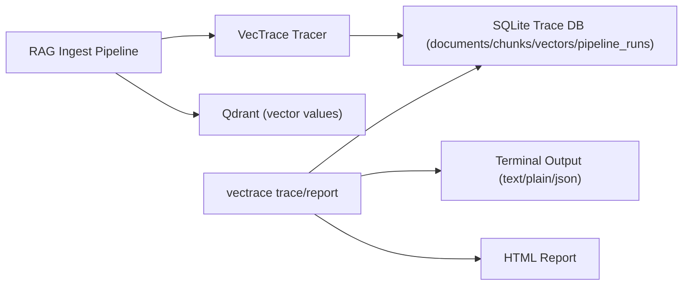

# VecTrace

**LLM gave a wrong answer? Trace it to the exact document and chunk in seconds.**

`vectrace` is a CLI to debug RAG pipelines by tracing answers back to their exact source — vector, chunk, and document.


Tagline:
- `vectrace — trace where your RAG answers come from`

## Why This Exists

When a RAG answer is wrong, teams often ask:
- Is the model hallucinating?
- Did retrieval return the wrong chunk?
- Which document version caused this?

VecTrace answers that quickly by giving you a concrete trace record tied to the retrieved vector.

## Failure Story (Real Debugging Flow)

Scenario:
- User query: `Can I get a refund after 90 days?`
- Assistant answer: `Yes, refunds are allowed.`
- Expected policy: refunds only within 30 days.

Debug with VecTrace:

```bash
vectrace trace --vector-id vec_101 --collection support_kb --db ./vectrace.db
```

Example outcome:
- `document.source_path = s3://kb/refund_policy_old.md` (outdated)
- `chunk.preview = "...refunds allowed after 90 days..."`

Result: you fix retrieval/index data instead of guessing at prompt changes.

## Report Screenshot


## Before vs After

Before:
- Guess whether the prompt is wrong.
- Re-run queries and compare outputs manually.
- Dig through logs and payloads by hand.

After:
- Run `vectrace trace --vector-id <id> --collection <name> --db ./vectrace.db`.
- See the exact vector -> chunk -> document path immediately.
- Fix the real cause (bad source/chunk/index) faster.

## MVP Capabilities

- Track traces from document -> chunk -> vector.
- Trace a vector ID back to the exact source.
- Generate a shareable HTML trace report.
- Onboard new users in one command (`vectrace onboard`).

## When To Use VecTrace

Use VecTrace when:
- LLM responses are incorrect and you need root cause.
- You do not know which source document/chunk influenced the answer.
- You need evidence to share with teammates in Slack/Notion/GitHub.
- You want machine-readable trace output in CI (`--format json`).

## How It Works



## Quickstart

```bash
python3 -m venv .venv
source .venv/bin/activate
python3 -m pip install setuptools wheel
python3 -m pip install -e . --no-build-isolation
vectrace init --db ./vectrace.db
vectrace onboard --db ./vectrace.db --output ./trace-demo.html
```

Record trace data in your pipeline:

```python
from lineage.tracker import LineageTracker

tracker = LineageTracker("./vectrace.db", autoinit=True)
tracker.start_pipeline("example_ingest")
tracker.record_document(
    doc_id="doc_123",
    source_path="s3://bucket/support.pdf",
    source_type="s3",
    version="v1",
)
tracker.record_chunk(
    chunk_id="doc_123:chunk:0",
    document_id="doc_123",
    chunk_index=0,
    strategy="semantic",
    chunk_size=54,
    text_preview="Customer wants a refund for the broken product",
)
tracker.record_vector(
    vector_id="0",
    collection_name="support_kb",
    chunk_id="doc_123:chunk:0",
    embedding_model="text-embedding-3-small",
    model_version="2024-06-01",
)
tracker.complete_pipeline("success")
tracker.close()
```

## CLI Commands

- `vectrace init --db ./vectrace.db`
- `vectrace onboard --db ./vectrace.db --output trace-demo.html`
- `vectrace seed-demo --db ./vectrace.db --collection support_kb --vectors 200 --docs 20`
- `vectrace record-retrieval --collection <name> --vector-id <id> --query-text "<query>" [--rank <n>] [--score <s>] [--final-answer "<text>"] [--metadata-json '{"k":"v"}']`
- `vectrace trace --vector-id <id> [--collection <name>] [--format text|json] [--plain] [--redact-preview] [--include-retrieval]`
- `vectrace report --vector-id <id> [--collection <name>] --output trace.html [--redact-preview] [--include-retrieval]`
- `vectrace connect --qdrant-url http://localhost:6333 --qdrant-collection <name> [--api-key ...]`

Onboard + trace + report:

```bash
vectrace onboard --db ./vectrace.db --output trace-demo.html
vectrace seed-demo --db ./vectrace.db --collection support_kb --vectors 200 --docs 20 --start-index 1000
vectrace trace --vector-id vec_demo_001 --collection support_kb --db ./vectrace.db
vectrace report --vector-id vec_demo_001 --collection support_kb --db ./vectrace.db --output trace-demo.html
```

Trace output options for CI and privacy:

```bash
vectrace trace --vector-id 0 --collection support_kb --format json
vectrace trace --vector-id 0 --collection support_kb --plain
vectrace trace --vector-id 0 --collection support_kb --redact-preview
vectrace report --vector-id 0 --collection support_kb --output trace.html --redact-preview
vectrace trace --vector-id 0 --collection support_kb --include-retrieval
vectrace report --vector-id 0 --collection support_kb --output trace.html --include-retrieval
```

Notes:
- JSON trace output includes `schema_version: "1.0"` for automation compatibility.
- `--plain` is text-only and cannot be used with `--format json`.

Record retrieval context (query/rank/score/final answer) for a vector:

```bash
vectrace record-retrieval \
  --db ./vectrace.db \
  --collection support_kb \
  --vector-id vec_101 \
  --query-text "Can I get a refund after 90 days?" \
  --rank 1 \
  --score 0.87 \
  --final-answer "Yes, refunds are allowed." \
  --metadata-json '{"request_id":"req-123"}'
```

## RAG Debugging Workflow (RAGLens + VecTrace)

Use RAGLens to inspect retrieval quality, then use VecTrace to pinpoint source provenance.

```bash
raglens explain --query "Can I get a refund after 90 days?" --top-k 5
# identify top vector id from retrieval output, e.g. vec_101
vectrace trace --vector-id vec_101 --collection support_kb --db ./vectrace.db
vectrace report --vector-id vec_101 --collection support_kb --db ./vectrace.db --output ./trace-vec_101.html
```

## Qdrant Integration

Install optional dependency:

```bash
python3 -m pip install qdrant-client
```

Then use `connectors.qdrant.TrackedQdrant` to upsert vectors and record trace metadata in one step.

## Terminal Demo GIF

Generate the launch/demo terminal GIF with VHS:

```bash
brew install vhs
./scripts/make_terminal_demo_gif.sh
```

Output:
- `demo/vectrace-demo.gif`

Tape source:
- `demo/vectrace-demo.tape`

## PyPI Publishing

Release checklist:
- `docs/PYPI_RELEASE.md`
- `scripts/build_dist.sh` (build + `twine check`)

GitHub Actions workflows:
- `.github/workflows/ci.yml` (tests + package build checks on push/PR)
- `.github/workflows/release.yml` (build + publish to PyPI on GitHub Release publish)

## Launch Post Draft

Ready-to-edit launch copy:
- `docs/LAUNCH_POST.md`

## Development Testing

```bash
python3 -m unittest discover -s tests -v
.venv/bin/python -m unittest discover -s tests -v
```
